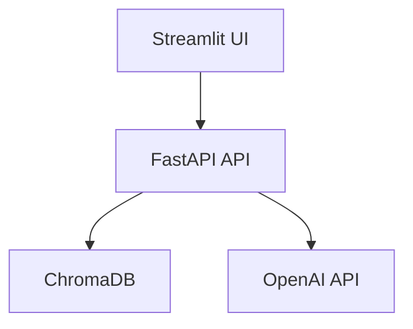

# Technical Requirements Document (TRD)

## 1. Executive Technical Summary
- **Project Overview**: 사내 슬랙 대화 내용을 검색하고 요약하여 개발자/PM이 기술 문제 해결책을 빠르게 찾을 수 있도록 지원하는 웹 애플리케이션을 개발합니다. Slack 데이터 임포트, OpenAI 임베딩 생성, 벡터 DB 저장, 자연어 질문 입력 및 답변 API, 간단한 웹 UI를 구현합니다.
- **Core Technology Stack**: Python 3.11, FastAPI, ChromaDB, OpenAI embeddings, Streamlit을 사용하여 빠르고 효율적인 MVP를 구축합니다.
- **Key Technical Objectives**: 첫 검색-응답까지 소요 시간 ≤ 5초, 사용자가 원하는 해결책을 3회 이내 검색으로 찾은 비율 ≥ 80%, MVP 도입 후 주간 활성 사용자(WAU) 팀 인원 대비 ≥ 60%를 달성합니다.
- **Critical Technical Assumptions**: OpenAI API의 안정적인 사용 가능, ChromaDB의 효율적인 벡터 검색 성능, 슬랙 export JSON 파일의 표준 형식 준수를 가정합니다.

## 2. Tech Stack

| Category          | Technology / Library        | Reasoning (Why it's chosen for this project) |
| ----------------- | --------------------------- | -------------------------------------------- |
| 언어              | Python 3.11                 | 생산성, 풍부한 라이브러리 생태계, 머신러닝/API 개발에 적합 |
| 웹 프레임워크      | FastAPI                     | 빠른 API 개발, 자동 문서화, 비동기 처리 지원 |
| 벡터 데이터베이스   | ChromaDB                    | 임베딩 저장 및 유사도 검색에 최적화, 간편한 사용 |
| 임베딩 모델       | OpenAI embeddings           | 높은 품질의 임베딩 제공, 다양한 텍스트 처리 작업 지원 |
| UI 프레임워크      | Streamlit                   | 간단하고 빠른 웹 UI 개발, 데이터 시각화에 용이 |
| 자연어 처리       | OpenAI API (ChatCompletion) | 질문에 대한 요약 답변 생성, 자연스러운 텍스트 생성 |
| 데이터 처리        | Pandas                      | 슬랙 데이터 파싱 및 전처리 |

## 3. System Architecture Design

### Top-Level building blocks
- **Frontend (Streamlit UI)**:
    - 사용자 인터페이스 제공
    - 검색어 입력 및 결과 표시
    - 슬랙 데이터 업로드 처리
    - 다크/라이트 모드 전환 (MVP+1)
- **Backend (FastAPI API)**:
    - API 엔드포인트 정의 및 관리
    - 슬랙 데이터 파싱 및 전처리 로직
    - OpenAI 임베딩 생성 및 ChromaDB 저장 로직
    - 검색어 기반 ChromaDB 검색 및 결과 요약
    - OpenAI API 호출 및 결과 반환
- **Vector Database (ChromaDB)**:
    - 슬랙 메시지 임베딩 저장
    - 유사도 검색 기능 제공
- **OpenAI API**:
    - 텍스트 임베딩 생성 (embeddings)
    - 질문에 대한 요약 답변 생성 (ChatCompletion)

### Top-Level Component Interaction Diagram



- **Frontend (Streamlit UI)**: 사용자의 검색어 입력을 받아 Backend (FastAPI API)로 전달하고, Backend에서 받은 검색 결과를 화면에 표시합니다.
- **Backend (FastAPI API)**: Frontend로부터 검색어 요청을 받아 ChromaDB에서 유사한 메시지를 검색하고, OpenAI API를 사용하여 요약 답변을 생성합니다.
- **Vector Database (ChromaDB)**: 슬랙 메시지 임베딩을 저장하고, Backend의 요청에 따라 유사도 검색을 수행합니다.
- **OpenAI API**: Backend의 요청에 따라 텍스트 임베딩을 생성하거나, 질문에 대한 요약 답변을 생성합니다.

### Code Organization & Convention
**Domain-Driven Organization Strategy**
- **Domain Separation**: 슬랙 데이터 처리, 임베딩 생성, 검색, UI 등 각 도메인별로 분리
- **Layer-Based Architecture**: API 엔드포인트 (presentation), 비즈니스 로직 (business logic), 데이터 접근 (data access), OpenAI API 호출 (infrastructure) 레이어 분리
- **Feature-Based Modules**: 검색 기능, 데이터 업로드 기능, UI 테마 기능 등 기능별 모듈화
- **Shared Components**: 공통 유틸리티 함수, 데이터 타입 정의 등을 shared 모듈에 저장

**Universal File & Folder Structure**
```
/
├── app/                      # FastAPI 애플리케이션
│   ├── api/                  # API 엔드포인트 정의
│   │   ├── endpoints.py      # API 엔드포인트 함수
│   ├── core/                 # 핵심 로직 및 설정
│   │   ├── config.py         # 설정 파일
│   │   ├── database.py       # 데이터베이스 연결
│   ├── services/             # 비즈니스 로직
│   │   ├── slack_data.py     # 슬랙 데이터 처리
│   │   ├── embedding.py      # 임베딩 생성 및 저장
│   │   ├── search.py         # 검색 로직
│   │   ├── openai_api.py     # OpenAI API 호출
│   ├── models/               # 데이터 모델 정의
│   │   ├── message.py        # 메시지 모델
│   ├── main.py               # FastAPI 애플리케이션 시작점
├── streamlit_app/          # Streamlit UI 애플리케이션
│   ├── ui.py               # UI 구성 요소
│   ├── utils.py            # UI 유틸리티 함수
│   ├── main.py               # Streamlit 애플리케이션 시작점
├── scripts/                # 스크립트
│   ├── data_import.py      # 데이터 임포트 스크립트
├── Dockerfile                # Dockerfile (MVP+1)
├── README.md                # README 파일
├── requirements.txt        # Python 의존성 목록
```

### Data Flow & Communication Patterns
- **Client-Server Communication**: Streamlit UI (client)가 FastAPI API (server)로 HTTP 요청을 보내고, API는 JSON 형식으로 응답합니다.
- **Database Interaction**: FastAPI API는 ChromaDB에 저장된 임베딩을 검색하기 위해 ChromaDB API를 사용합니다.
- **External Service Integration**: FastAPI API는 OpenAI API를 사용하여 텍스트 임베딩을 생성하고, 질문에 대한 요약 답변을 생성합니다.
- **Data Synchronization**: 데이터 일관성을 위해 ChromaDB에 저장된 임베딩은 슬랙 데이터가 업데이트될 때마다 재인덱싱됩니다.

## 4. Performance & Optimization Strategy
- **OpenAI API Rate Limit**: 메시지를 배치로 처리하고, 지수적 backoff를 적용하여 API 호출 횟수를 줄입니다.
- **대용량 데이터 인덱싱 지연**: 메시지를 청크 단위로 분할하여 인덱싱하고, 진행 상황을 사용자에게 시각적으로 표시합니다.
- **ChromaDB 검색 성능**: ChromaDB 인덱싱 최적화 및 적절한 검색 파라미터 설정으로 검색 속도를 향상시킵니다.
- **FastAPI 캐싱**: 자주 사용되는 API 응답을 캐싱하여 응답 시간을 단축합니다.

## 5. Implementation Roadmap & Milestones
### Phase 1: Foundation (MVP Implementation)
- **Core Infrastructure**: FastAPI API 및 Streamlit UI 기본 구조 설정, ChromaDB 연동
- **Essential Features**: 슬랙 데이터 임포트, 임베딩 생성 및 저장, 자연어 질문 입력 및 답변 API, 간단한 웹 UI
- **Basic Security**: API 엔드포인트에 대한 기본적인 인증 및 권한 관리
- **Development Setup**: 개발 환경 설정 및 CI/CD 기본 설정
- **Timeline**: 6시간 (해킹 세션)

### Phase 2: Feature Enhancement
- **Advanced Features**: 주기적 재인덱싱 스케줄링, Dockerfile 및 원클릭 배포 스크립트, 세련된 UI/다크·라이트 테마
- **Performance Optimization**: ChromaDB 검색 성능 최적화, FastAPI 캐싱 적용
- **Enhanced Security**: API 보안 강화, 데이터 암호화
- **Monitoring Implementation**: 시스템 모니터링 및 로깅 설정
- **Timeline**: 1-2주

## 6. Risk Assessment & Mitigation Strategies
### Technical Risk Analysis
- **Technology Risks**: OpenAI API의 불안정성 및 ChromaDB 성능 문제
    - **Mitigation Strategies**: OpenAI API 에러 처리 및 재시도 로직 구현, ChromaDB 성능 모니터링 및 튜닝
- **Performance Risks**: 대용량 데이터 처리 시 인덱싱 지연 및 검색 속도 저하
    - **Mitigation Strategies**: 데이터 청크 분할, 인덱싱 최적화, 캐싱 적용
- **Security Risks**: API 엔드포인트에 대한 무단 접근 및 데이터 유출
    - **Mitigation Strategies**: API 인증 및 권한 관리 강화, 데이터 암호화
- **Integration Risks**: OpenAI API 및 ChromaDB와의 호환성 문제
    - **Mitigation Strategies**: API 버전 관리 및 호환성 테스트

### Project Delivery Risks
- **Timeline Risks**: 개발 일정 지연 및 예상치 못한 문제 발생
    - **Contingency Plans**: 우선순위가 낮은 기능 축소, 외부 라이브러리 활용
- **Resource Risks**: 개발 인력 부족 및 기술적 어려움
    - **Contingency Plans**: 팀원 간 협업 강화, 외부 전문가 자문
- **Quality Risks**: 코드 품질 저하 및 버그 발생
    - **Contingency Plans**: 코드 리뷰 강화, 자동화된 테스트 구축
- **Deployment Risks**: 배포 환경 문제 및 시스템 장애
    - **Contingency Plans**: 배포 자동화, 롤백 전략 수립
